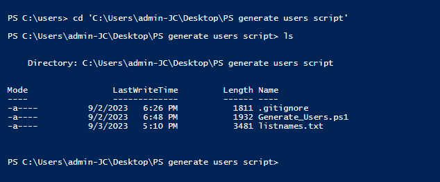
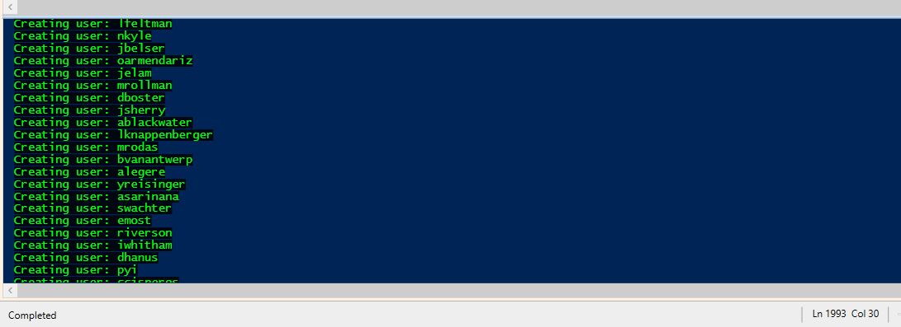
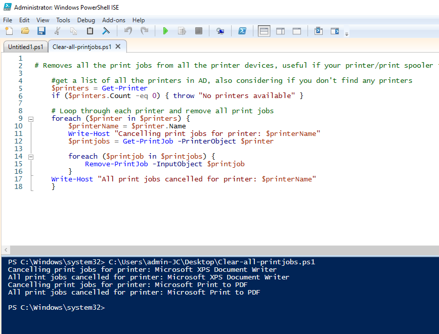

<h1>🧱 PowerShell scripts for AD environment</h1>
Blog post for a more detailed walk-through >  (link to come)

<h2>📙 Description</h2>

Here you will find two very simple **PowerShell utility scripts**, to be used in Active Directory and Windows environment.
<br />
<br />
- The first script, ```Generate_Users.ps1```, will automatically add any number of users to the Active Directory database, by taking the list of names and surnames from the file ```listnames.txt```, and creating a folder called ```_USERS```, keep in mind that you can change the name of the folder. You will specify name and surname in the txt file of each user that you would like to add, follow the format of the examples already present in ```listnames.txt```, that is "first name" + space + "last name". <br />
The first line of the ```listnames.txt``` file is a placeholder for your name and surname, if you want to add yourself as the first user who gets added to AD.
<br />

*note*: in the .ps1 file (PowerShell code) there are a lot of comments explaining what the code does/how to modify it etc., feel free to ignore them or delete them.
<br />
<br />

- The second script, ```Clear-all-printjobs.ps1```, will clear the printing queue and cancel any print jobs that might be there. It could be useful to troubleshoot issues with your printer (if the issue is software related, and not hardware related), if for example the print spooler is stuck then clearing the print job queue could fix the issue. <br />
This script will also get and display the name of the printers (if any) and let you know if any print job has been cancelled.
<br />

<h2>📗 Tested environments</h2>

- <b>Windows 10/11, Windows Server 2022</b>

<h2>Screenshots</h2>

Enter the following line to be able to run the Generate_Users script (you can change it back after):  <br />


<br />

Use the cd command to go where the txt file is stored: <br />


<br />
Alternatively, you can put the path of where the txt file is stored directly into the code of the script.

The Generate_Users script in function: <br />


<br />
Keep in mind that what's being displayed is the "username", which is a combination of the first letter of the first name and the full last name (e.g. Adam Smith will have the username of "asmith"), if you check the profile associated with those usernames in Active Directory you will also find the full first name and last name of each user.
<br />
<br />

Execution of the second script, clearing all the print jobs: <br />


<br />
<br />

<!-- If you want to upload the image instead of using a relative path:   
!-->

