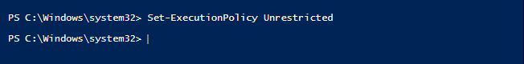

<h1>🧱 Powershell scripts for AD environment</h1>

These scripts are fairly simple and were used to test scripting with Powershell inside my [Active Directory Homelab](https://tektsunami.com/adhomelab.html). You can read more about it on my website. <br />
{ On top of the first 2 scripts, of which you can find screenshots and a short guide, additional scripts might be added over time, all tested and used in Virtual environments }

<h3>🔺 Experience gained from Homelab: </h3>

- Using and Managing Windows Server and Windows 10/11 within Virtual Machines. (VMware / VirtualBox) <br />
- Configuration of Active Directory services, DHCP, DNS, GPOs and so on. <br />
- Basic scripting and automation with Powershell for common use cases. <br />

<br />
<h2>📙 Description</h2>

A brief description of the **PowerShell utility scripts** present in this repository.
<br />
<br />
- The first script, ```Generate_Users.ps1```, will automatically add any number of users to the Active Directory database, by taking the list of names and surnames from the file ```listnames.txt```, and creating a folder called ```_USERS```, keep in mind that you can change the name of the folder. You will specify name and surname in the txt file of each user that you would like to add, follow the format of the examples already present in ```listnames.txt```, that is "first name" + space + "last name". <br />
The first line of the ```listnames.txt``` file is a placeholder for your name and surname, if you want to add yourself as the first user who gets added to AD.
<br />

- The second script, ```Clear-all-printjobs.ps1```, will clear the printing queue and cancel any print jobs that might be there. It could be useful to troubleshoot issues with your printer (if the issue is software related, and not hardware related), if for example the print spooler is stuck then clearing the print job queue could fix the issue. <br />
This script will also get and display the name of the printers (if any) and let you know if any print job has been cancelled.
<br />

- The third script, called ```info-system.ps1```, shows the system information (such as BIOS, CPU, RAM, OS Version etc.) of your local computer. It uses the <b>Windows Management Interface (WMI)</b> cmdlet: WMI is a popular management interface that can access data of a given computer. However, WMI is being deprecated, and PowerShell today relies heavily on PSRemoting and the security features it includes, which is why I recommend using the <b>Get-CIMInstance</b> cmdlet instead for more complex/security-related scripts.
<br />

- The fourth script, called ```windows-defender.ps1```, gives the user 3 options to pick from, all related to Windows Defender: Option 1) checks the Windows Defender status and shows the scheduled scan day, Option 2) Disables real-time protection, Option 3) Enables real-time protection. Useful in test environments where you want to quickly disable/enable Windows Defender or see its current status.
<br />

<h2>📗 Tested environments</h2>

- <b>Windows 10/11, Windows Server 2022</b>

<h2>Screenshots & Guide</h2>

Run Windows PowerShell ISE with admin rights and enter the following line to be able to run the Generate_Users script (you can change it back after):  <br />


<br />

Use the cd command to go where the txt file is stored: <br />


<br />
Alternatively, you can put the path of where the txt file is stored directly into the code of the script.

The Generate_Users script in function: <br />


<br />
Keep in mind that what's being displayed is the "username", which is a combination of the first letter of the first name and the full last name (e.g. Adam Smith will have the username of "asmith"), if you check the profile associated with those usernames in Active Directory you will also find the full first name and last name of each user.
<br />
<br />

For the second script, simply execute the PowerShell file and it will clear all the print jobs: <br />


<br />
<br />

<!-- If you want to upload the image instead of using a relative path:   
!-->

